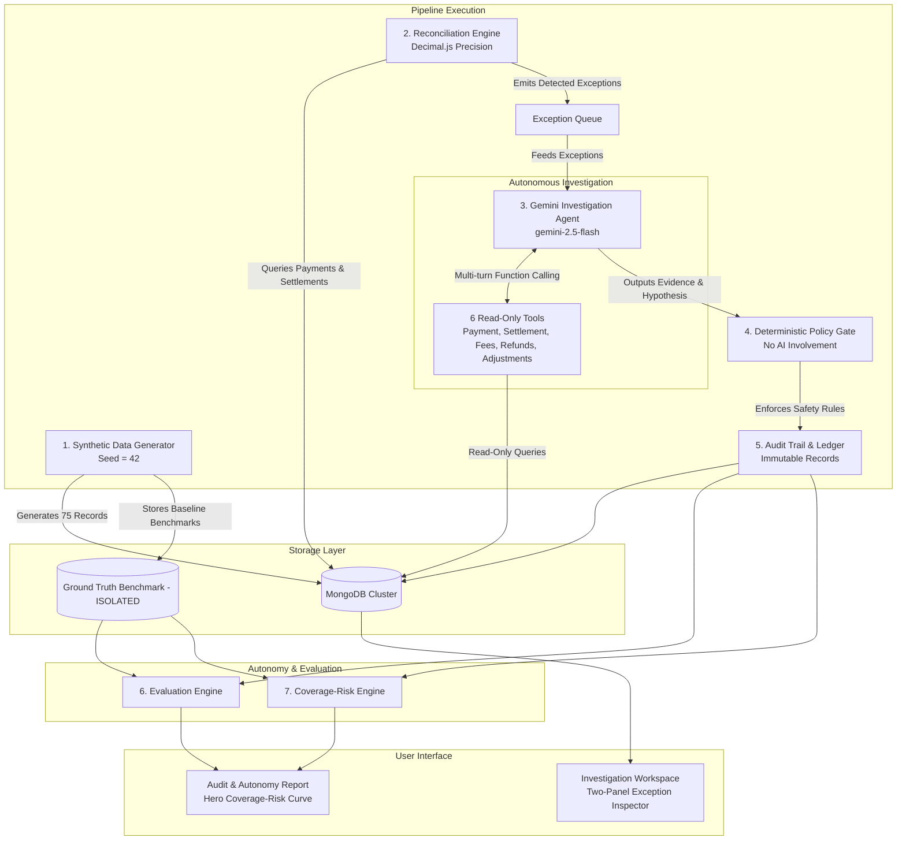

# FINRESOLVE — System Architecture & Design Specification

This document details the architectural principles, data flow pipelines, deterministic safety gates, and agent isolation boundaries of FINRESOLVE.

---

## 🏗️ High-Level System Architecture



---

## 🔄 The 5-Stage Data Flow Pipeline

```
BATCH GENERATION ➔ RECONCILIATION ➔ INVESTIGATION ➔ POLICY GATE ➔ AUDIT & EVALUATION
```

### Stage 1: Batch Synthesis (`dataGenerator.ts`)
- Utilizes a seeded PRNG (`Mulberry32`, seed = 42) to generate an exact 75-record distribution.
- Creates transactions across 10 synthetic merchants (`MER-001` to `MER-010`) and 4 payment methods (`upi`, `card`, `netbanking`, `wallet`).
- Simultaneously populates the isolated `GroundTruth` collection.

### Stage 2: Deterministic Reconciliation (`reconciliationEngine.ts`)
- Gathers payments, settlements, fees, refunds, and adjustments for the batch.
- Computes expected net settlement using `FinanceEngine.calculateExpectedSettlement`.
- Flags 10 anomaly types (Fee mismatch, GST mismatch, Missing settlement, Duplicate payout, Partial settlement, Unadjusted refund, Duplicate refund, Unexpected penalty, Amount variance, Multi-factor).
- Persists all exceptions with status `detected`.

### Stage 3: Autonomous Investigation Agent (`investigationAgent.ts`)
- Employs a single Gemini instance (`gemini-2.5-flash`) orchestrated with 6 read-only function tools.
- Iterates up to 8 tool executions per exception to gather multi-source evidence.
- Computes `confidence` (0.0–1.0), `evidenceCompleteness` (0.0–1.0), root cause, and recommendations (`auto_resolve`, `escalate`, `insufficient_evidence`).
- **Fail-Safe Mechanism**: In the event of API timeout or network failure, it fails open to `escalate`.

### Stage 4: Deterministic Policy Gate (`policyGate.ts`)
- Evaluates 5 safety checkpoints strictly in order:
  1. `Confidence Check`: Is confidence $\ge 0.85$?
  2. `Completeness Check`: Is evidence completeness $\ge 0.80$?
  3. `Financial Impact Check`: Is discrepancy $\le ₹10,000$?
  4. `Permitted Type Check`: Is the exception type in `[fee_mismatch, gst_mismatch, refund_not_adjusted, amount_mismatch, partial_settlement]`?
  5. `Agent Recommendation Check`: Did agent explicitly recommend `auto_resolve`?
- Only if **all 5 checks pass** does it commit `auto_resolve`. Otherwise, it forces `escalate`.

### Stage 5: Audit Trail & Ground Truth Evaluation (`auditService.ts`, `evaluationEngine.ts`)
- Records immutable `AuditRecord` documenting exact rule outcomes and timestamped decisions.
- Evaluation engine queries isolated `GroundTruth` to calculate true accuracy, false auto-resolution rate, error exposure (₹), and throughput.

---

## 🧮 Financial Precision: Zero Floating-Point Money

All currency calculations use `Decimal.js` configured with:
```typescript
Decimal.set({
  precision: 20,
  rounding: Decimal.ROUND_HALF_UP,
  toExpNeg: -20,
  toExpPos: 20
});
```

All API endpoints serialize monetary values as string representations (`"1499.50"`) to prevent IEEE 754 floating-point conversion errors in client browsers.

---

## 🛠️ The 6 Agent Tools Contract

1. `retrieve_payment_details(paymentId)`: Fetches payment metadata and matching settlement documents.
2. `retrieve_related_records(paymentId)`: Gathers associated fees, customer refunds, and debit adjustments.
3. `calculate_expected_settlement(paymentId)`: Invokes deterministic `FinanceEngine` to compute theoretical net payout.
4. `compare_financial_states(paymentId)`: Compares expected vs actual amounts, computing net variance and anomaly signatures.
5. `inspect_transaction_history(merchantId, limit)`: Analyzes historical merchant settlement batches to detect recurring rate skews.
6. `search_duplicates(paymentId)`: Searches across clearing collections for twin UTR references or duplicate webhook executions.

---

## 🔐 Isolation & Ground Truth Integrity

```
+-----------------------------+           +-----------------------------+
|   Investigation Agent       |           |     Evaluation Engine       |
|   (LLM + 6 Read-Only Tools) |           |  (Ground Truth Benchmark)   |
+-----------------------------+           +-----------------------------+
               |                                         |
               v                                         v
   Payments, Settlements, Fees,               GroundTruth Collection
     Refunds, Adjustments                     (STRICTLY ISOLATED)
```

The agent is never given access to `GroundTruth` collection or benchmark labels. Ground truth is solely consumed by `evaluationEngine.ts` and `coverageRiskEngine.ts` to objectively score accuracy.
